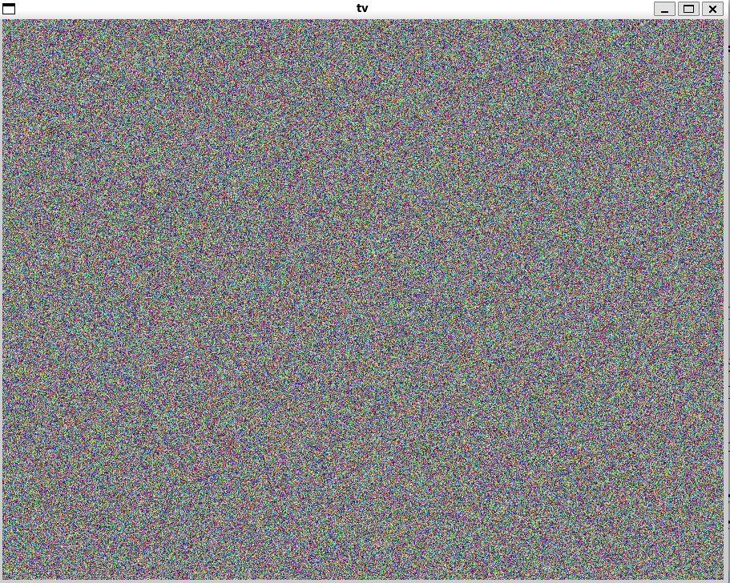

# TV Static Simulator

A TV static effect simulator in C using SDL2 for real-time pixel manipulation and rendering.

<div align="center">
  
</div>

## 📋 Overview

This project recreates the classic "white noise" static effect seen on old analog televisions. The application demonstrates fundamental graphics programming concepts including:

- Direct pixel manipulation with SDL2 surfaces
- Real-time random data generation

## 🛠️ Technologies

- C - Core programming language
- SDL2 - Graphics, window management, and surface manipulation
- GCC - Compiler

## ⚙️ Installation & Setup

**Prerequisites**  
First, install the SDL2 development library:  

Ubuntu/Debian:  

```bash
sudo apt update  
sudo apt install libsdl2-dev  
```

macOS (using Homebrew):
  
```bash
brew install sdl2
```

**Compilation**  
Compile the game using GCC:  

```bash
gcc tv.c -o tv -lSDL2
```

**Running the Game**  
Execute the compiled binary:  

```bash
./tv
```
